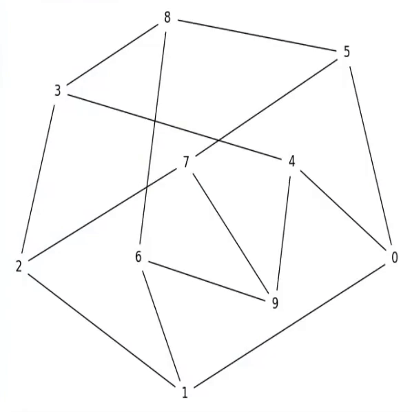
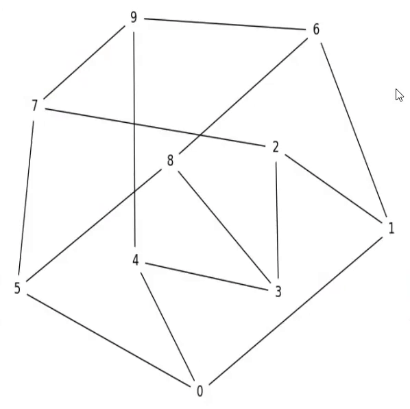
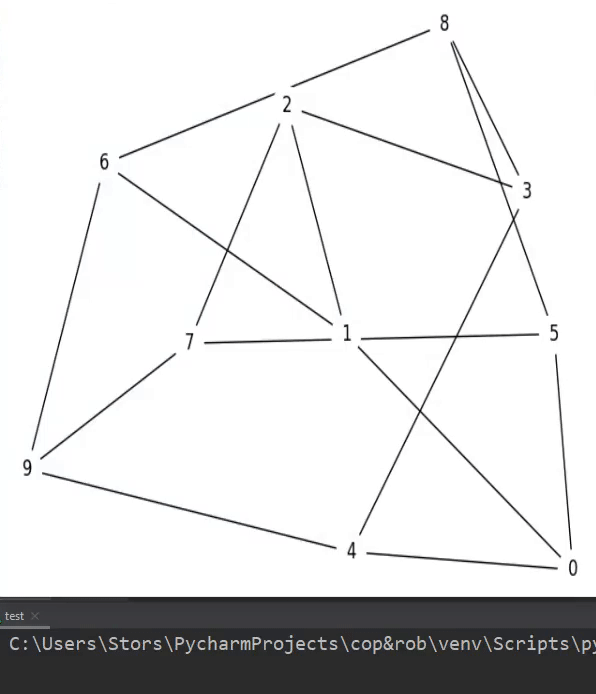
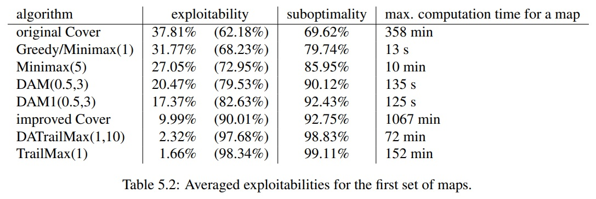

# Cop-Robbers-Gym
An openai gym that allows agent to catch bad guys and bad guys to escape from the long arm of the law.

# What is provided in this gym?

## Controllers:

Basic controllers are useful when one only wants to train one of the sides of this problem. 
### A naive controller for both the robber and the cops is provided. 
Notice that even though its decision rules are fairly simple, it still offers non-terrible
performance. Here are a few examples on the Petersen graph (which is of cop number 3):

With one cop:

With two cops:
 

With three cops (the robber instantly loses):

### The DAM/DAM1 (Dynamic Abstract Minimax) controller

As explored in this paper https://era.library.ualberta.ca/items/204f907a-0f02-4ee5-a42a-0c0baa364543 .

The paper does say that DATrailMax and TrailMax offer the best "suboptimality" of the included algorithms. 

However, notice
that the computation time column indicates that both of those algorithms may require more than an hour of computation. This
is completely inadequate for our setting.

The next-best thing is improved Cover, but its computation time is even worse. 

Hence, DAM and DAM1 were chosen for this project, as they offer only 7 to 9 percent worse suboptimality while being able to
parse maps in around two minutes.

DAM was first defined in https://www.aaai.org/Papers/Workshops/2006/WS-06-11/WS06-11-012.pdf . DAM1 is a simple modification of DAM where
the lookahead is fixed to 1.

DAM uses the graph abstraction technique described in http://citeseerx.ist.psu.edu/viewdoc/download;jsessionid=E329D415068066663D34B192EAB274D7?doi=10.1.1.122.4060&rep=rep1&type=pdf .

# Related work

Cops&robbers has been extensively studied in graph theory. However, we are still very far from a feasible algorithm, that could inform us on the "cop-win-ness" of any graph. 

https://www.researchgate.net/publication/317309149_Linguistic_Geometry_Approach_for_Solving_the_Cops_and_Robber_Problem_in_Grid_Environments 

https://www.google.com/url?sa=t&source=web&rct=j&url=http://webdocs.cs.ualberta.ca/~nathanst/papers/TrailMax.pdf&ved=2ahUKEwi_3c3F_vHrAhVxk-AKHVhlCHsQFjAEegQIBBAB&usg=AOvVaw0MEzu6bxMoV1wrA0PC2zC3&cshid=1600407784378

Simultaneous case: 
https://era.library.ualberta.ca/items/204f907a-0f02-4ee5-a42a-0c0baa364543

# Notes

For finding cliques: define "coarseness" from 1/1 1/2 1/3 etc. Take coarseness times NB nodes. For each level of abstraction, repeatedly find all triangles, collapse them until we're at coarseness, and then remove leaves.

https://www.aaai.org/Papers/Workshops/2006/WS-06-11/WS06-11-012.pdf is real time, and agents cant move while they think. Doesnt really matter here, as our env if just more similar to https://era.library.ualberta.ca/items/204f907a-0f02-4ee5-a42a-0c0baa364543
